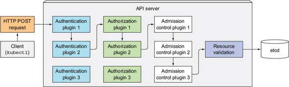
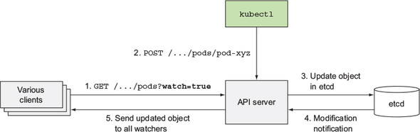

# Understanding API Server

- [Understanding API Server](#understanding-api-server)
  - [API Server의 역할](#api-server%EC%9D%98-%EC%97%AD%ED%95%A0)
  - [API Server의 동작](#api-server%EC%9D%98-%EB%8F%99%EC%9E%91)
  - [API Server가 Resource 변경을 통지하는 방법](#api-server%EA%B0%80-resource-%EB%B3%80%EA%B2%BD%EC%9D%84-%ED%86%B5%EC%A7%80%ED%95%98%EB%8A%94-%EB%B0%A9%EB%B2%95)

## API Server의 역할
* Cluster의 상태를 조회 및 수정할 수 있는 Interface 제공.
* 변경된 상태를 etcd에 저장.
* Resource의 유효성 검사.

## API Server의 동작


* Authentication Plugin
  * 클라이언트 인증
* Authorization Plugin
  * 클라이언트 인가
* Admission Control Plugin
  * 리소스의 수정 및 검증
* Resource Validation
  * 리소스의 검증

## API Server가 Resource 변경을 통지하는 방법


1. API Server는 etcd의 watch interface를 이용하여 Subscribe
2. Client는 API Server에 관심있는 Resource에 대해 watch interface를 이용하여 Subscribe
3. API Server에 Resource 변경 요청 발생 시 검증 후 etcd에 저장
4. etcd에서 변경이 발생하면 해당 Resource를 모든 API Server에 Publish
5. API Server는 watch를 요청한 클라이언트들에게 Publish

```
$ vi /etc/kubernetes/manifests/kube-apiserver.yaml

apiVersion: v1
kind: Pod
metadata:
  ...
spec:
  containers:
  - command:
    ...
    - --insecure-port=8080

$ systemctl restart kubelet
```
도
```
$ curl --http1.0 http://localhost:8080/api/v1/pods?watch=true

$ curl http://localhost:8080/api/v1/pods?watch=true
```

* HTTP 1.1
```
$ tcpdump -nlA -i lo port 8080
05:33:24.628863 IP 127.0.0.1.44242 > 127.0.0.1.8080: Flags [P.], seq 1:101, ack 1, win 342, options [nop,nop,TS val 925974024 ecr 925974024], length 100: HTTP: GET /api/v1/pods?watch=true HTTP/1.1
E....w@.@.o..............Q..jn.....V.......
71>.71>.GET /api/v1/pods?watch=true HTTP/1.1
Host: localhost:8080
User-Agent: curl/7.58.0
Accept: */*
05:33:24.629526 IP 127.0.0.1.8080 > 127.0.0.1.44242: Flags [P.], seq 1:117, ack 101, win 342, options [nop,nop,TS val 925974025 ecr 925974024], length 116: HTTP: HTTP/1.1 200 OK
E...;_@.@...............jn...Q.=...V.......
71>	71>.HTTP/1.1 200 OK
Content-Type: application/json
Date: Fri, 22 Mar 2019 05:33:24 GMT
Transfer-Encoding: chunked
9cf
{"type":"ADDED","object":{ ... }}
19a2
{"type":"ADDED","object":{ ... }}
aab
{"type":"MODIFIED","object":{ ... }}
....
```