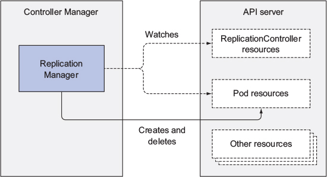
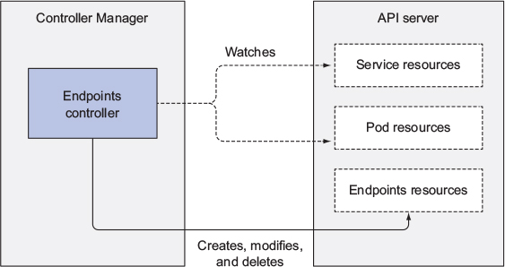

# Understanding Controller

- [Understanding Controller](#understanding-controller)
  - [Controller의 역할](#controller%EC%9D%98-%EC%97%AD%ED%95%A0)
  - [Controller의 동작](#controller%EC%9D%98-%EB%8F%99%EC%9E%91)
    - [ReplicatioManager & ReplicaSetController의 동작](#replicatiomanager--replicasetcontroller%EC%9D%98-%EB%8F%99%EC%9E%91)
    - [Endpoint Controller의 동작](#endpoint-controller%EC%9D%98-%EB%8F%99%EC%9E%91)

## Controller의 역할
* Current State -> Desired State
* Observe -> Compare -> Action

## Controller의 동작
* API Server를 통해 Resource의 변경사항을 감시.
* Resource의 생성, 수정, 삭제 등의 Action을 수행.
* 변경 된 실제 상태를 Resource의 Status 필드에 반영.
* Controller 간, Controller와 Kubelet 간에는 서로 직접 통신하지 않음.

### ReplicatioManager & ReplicaSetController의 동작

### Endpoint Controller의 동작
