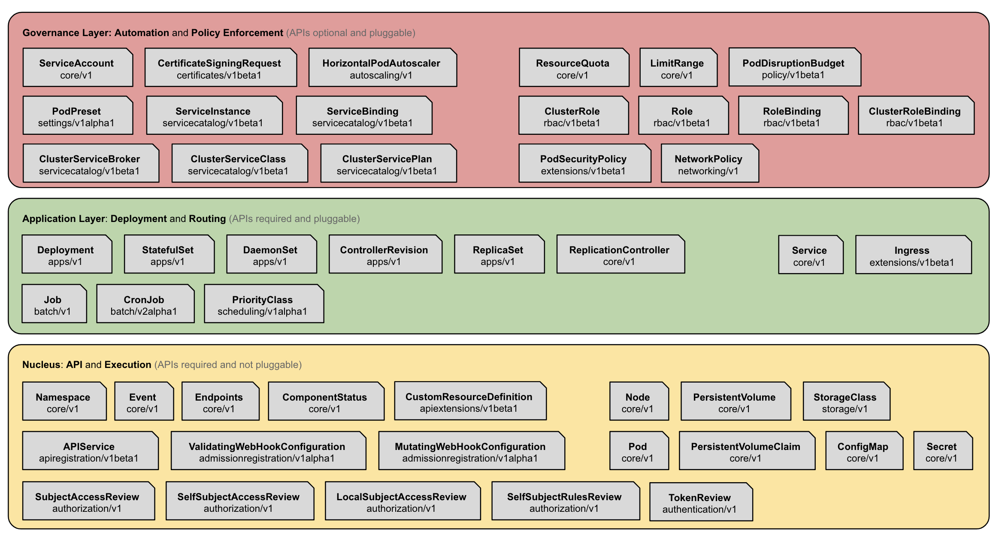
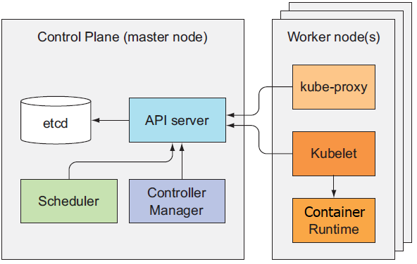

# Kubernetes Design and Architecture

- [Kubernetes Design and Architecture](#kubernetes-design-and-architecture)
  - [Overview](#overview)
  - [Goals](#goals)
  - [System Layers](#system-layers)
  - [Architecture](#architecture)
    - [Cluster Control Plane](#cluster-control-plane)
      - [API Server](#api-server)
      - [Cluster State Store (etcd)](#cluster-state-store-etcd)
      - [Controller-Manager Server](#controller-manager-server)
      - [Scheduler](#scheduler)
    - [The Kubernetes Node](#the-kubernetes-node)
      - [Kubelet](#kubelet)
      - [Container Runtime](#container-runtime)
      - [Kube-Proxy](#kube-proxy)
    - [Add-ons](#add-ons)

## Overview
* Kubernetes는 컨테이너의 배포, 확장, 관리 및 구성을 위한 프로덕션 급의 오픈 소스 인프라

## Goals
1. Portable.
   * Kubernetes run everywhere (public cloud, private cloud, bare metal, laptop ...)
2. General-purpose.
   * single infrastructure, stateless and stateful, microservices and monoliths, services and batch 등 모든 작업을 처리할 수 있도록 지원.
3. Meet users partway.
   * microservices 및 클라우드 고유 응용 프로그램의 배포 및 관리에 중점을두고 있지만 monoliths 응용 프로그램과 레거시 응용 프로그램도 쉽게 마이그레이션 할 수있는 메커니즘을 제공.
4. Flexible.
   * Kubernetes는 단독으로 실행될 수 있으며, Kubernetes의 제공된 기능 대신의 Solution의 사용을 방해하지 않음.
5. Extensible.
   * 필요한 추가 기능을 얼마든지 확장 가능.
6. Automatable.
   * 수동작업의 부담을 줄이는 것이 목표. 선언적 제어를 지원.
7. Advanced the state art.
   * non-cloud-native를 지원하지만, cloud-native, DevOps의 기술의 발전에도 기여. Container Runtime, Cloud Provider 등에 종속되지 않음.

## System Layers

* Nucleus Layer
  * kubernetes를 구성하는 기본 기능을 제공.
  * Pod, Container Interface, Network Interface, Storage Volume Management 등을 제공.
  * 해당 영역은 선택 사항이 아니고, 가장 안정적으로 제공되어야 하는 영역.
* Application Layer
  * 기본적인 배포와 라우팅을 제공.
  * self-healing, scaling, service discovery, load balancing, traffic routing등을 제공.
  * 기본 기능이 이미 제공되지만, 대체 가능.
* Governance Layer
  * 고수준의 자동화 및 정책을 제공.
  * metrics, autoscaling, autorization, quota, network, storage policy 등을 제공.
  * 선택적이며 다른 솔루션을 통해서도 제공 가능.
* Interface Layer
  * Kubernetes API와 상호 작용하는데 사용되는 Library, Tools, UI등을 포함.
* Ecosystem
  * Kubernetes 관련된 모든 것을 포함하지만, Kubernetes의 일부는 아님.
  * CI/CD, logging, monitoring, PaaS, FaaS, Container Runtime, Cloud Provider...

## Architecture
* Kubernetes 클러스터에는 노드 에이전트 (kubelet)와 클러스터 제어 플레인이 있으며 클러스터 상태는 분산 저장 시스템 (etcd)으로 백업.

### Cluster Control Plane
* Kubernetes는 Control Plane의 허브 역할을하는 대부분의 리소스에 대한 CRUD 작업을 지원하는 REST API를 제공.
* 모든 Client는 동일한 API Resource와 상호 작용.
* 컨트롤러는 지속적으로 actual state를 desired state로 유지.
  
#### API Server
* 클러스터 상태를 조회 및 수정할 수 있는 인터페이스 제공.
* 변경된 상태를 저장소에 저장.
* Resource의 유효성 검사.

#### Cluster State Store (etcd)
* 모든 영구 클러스터 상태는 etcd의 인스턴스에 저장.
* watch interface를 사용하여 변경사항을 신속하게 전파.

#### Controller-Manager Server
* 대부분의 클러스터 레벨의 기능은 Controller-Manager에서 별도의 프로세스로 동작
* 쉽게 확장 및 대체될 수 있음.

#### Scheduler
* Scheduler는 호스트에 할당되지 않은 Pod을 감시하여, 적절한 호스트에 배정.

### The Kubernetes Node
* Kubernetes 노드는 응용 프로그램 컨테이너를 실행하고 마스터 시스템에서 관리되는 데 필요한 서비스를 제공.

#### Kubelet
* Kubernetes에서 가장 중요
* Kubelet은 컨테이너 실행 레이어를 구동하는 Pod 및 Node API의 실제 구현자.

#### Container Runtime
* 이미지를 다운로드 받거나, 컨테이너를 실행.

#### Kube-Proxy
* 각 노드에서 실행되며, Service Resource 추상화를 구현.
* userspace, iptables, ipvs, kernelspace 모드를 지원.

### Add-ons
* Add-on 추가 기능들 또한 Kubernetes 내에서 실행.
* ex) DNS, Ingress, Dashboard ...