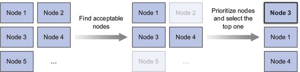

# Understanding Scheduler

- [Understanding Scheduler](#understanding-scheduler)
  - [Scheduler의 역할](#scheduler%EC%9D%98-%EC%97%AD%ED%95%A0)
  - [Scheduler의 기본 동작](#scheduler%EC%9D%98-%EA%B8%B0%EB%B3%B8-%EB%8F%99%EC%9E%91)
  - [Scheduler가 허용하는 노드를 선택하는 방법](#scheduler%EA%B0%80-%ED%97%88%EC%9A%A9%ED%95%98%EB%8A%94-%EB%85%B8%EB%93%9C%EB%A5%BC-%EC%84%A0%ED%83%9D%ED%95%98%EB%8A%94-%EB%B0%A9%EB%B2%95)

## Scheduler의 역할
* 생성 된 Pod이 동작할 Node를 선택.
* Pod에 Node를 할당.
* Pod.PodSpec.NodeName만 변경(실제 Container의 실행을 하지 않음).

## Scheduler의 기본 동작

* Pod이 할당될 수 있는 Node의 목록을 필터링.
* 허용하는 노드 중 우선순위로 정렬하여 최적의 노드를 선택.

## Scheduler가 허용하는 노드를 선택하는 방법
* node가 pod의 request resource 이상의 여분이 있는가?
* node에 리소스가 부족한가?
* node가 pod 스펙의 노드 셀렉터에 맞는 라벨을 가졌는가?
* pod이 특정 호스트 포트에 바인딩을 요청하는 경우 해당 node에 포트가 이미 사용되고 있는가?
* pod이 특정 볼륨 유형을 요청하는 경우, 이 볼륨을 node의 pod에 마운트할 수 있는가?
* pod는 node의 taints를 허용하는가?